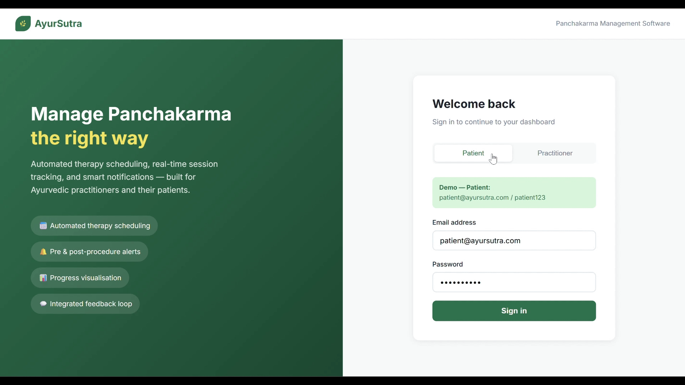
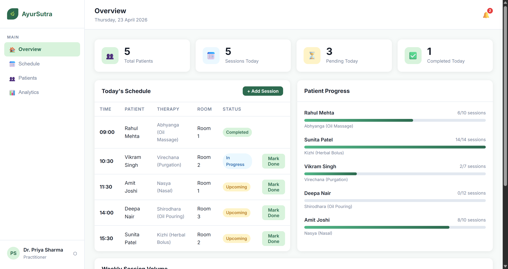
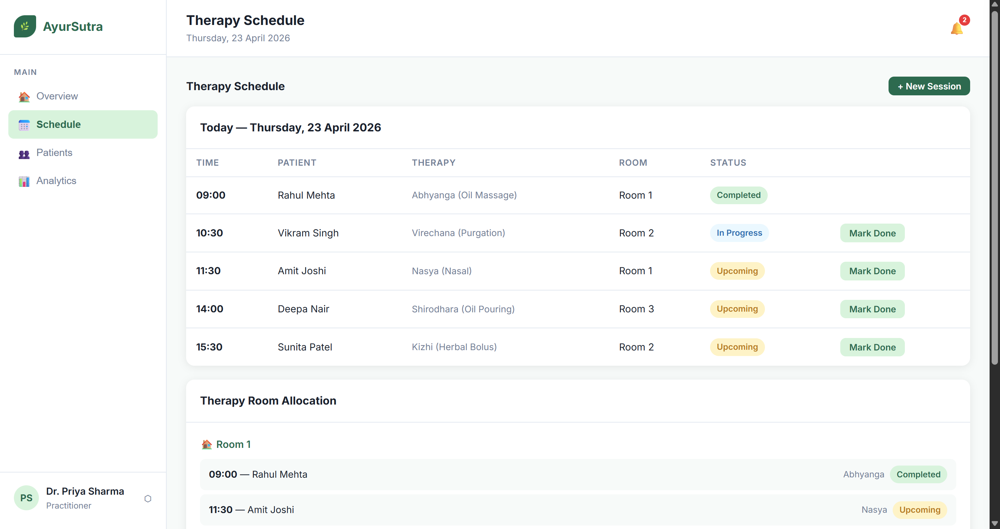
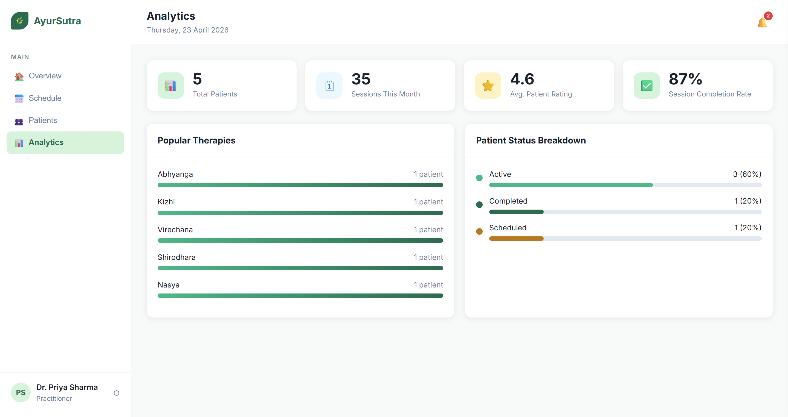
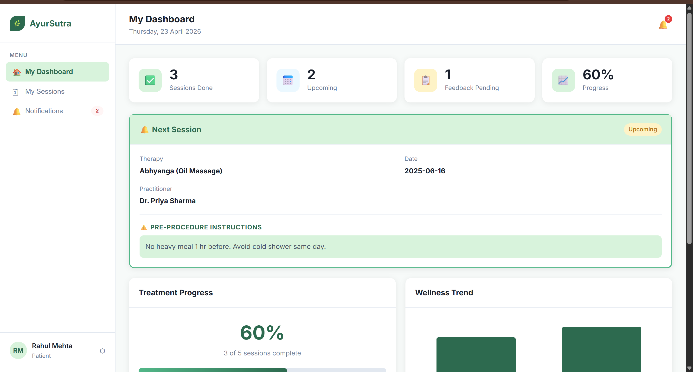

# 🌿 AyurSutra — Panchakarma Patient Management Software


> Automated therapy scheduling, real-time session tracking, and smart pre/post-procedure notifications for Ayurvedic clinics.

[🌐 Live Demo](https://meel-ayush.github.io/AyurSutra-Healthcare-Platform/) • [🚀 Features](#-features) • [📸 Screenshots](#-screenshots) • [🏗️ Project Structure](#️-project-structure) • [🛣️ Future Goals](#️-future-goals)

---

## 📸 Screenshots

### 🔐 Login



### 👨‍⚕️ Practitioner Views

**Overview**



**Schedule**



**Analytics**



### 🧘 Patient Views

**Patient Dashboard**



> 📂 All screenshots are in the [`screenshots/`](screenshots/) folder at the project root.

---

## 🤔 The Problem

Panchakarma clinics in India still run on **paper schedules and WhatsApp reminders**. Practitioners spend hours every day manually booking sessions, remembering which patients need what pre-procedure instructions, and chasing patients for feedback.

Missed reminders lead to patients showing up unprepared — wasted appointments, reduced treatment effectiveness, and frustrated practitioners.

**I built AyurSutra to fix that.**

---

## 💡 What AyurSutra Does

AyurSutra is a two-role web app — one interface for the **practitioner**, one for the **patient** — that handles everything from scheduling to post-session feedback in one place.

- The **practitioner** can schedule sessions, manage patients, track therapy progress, and see analytics
- The **patient** gets automatic pre/post-procedure instructions for their specific therapy, views their progress milestones, and submits feedback after each session
- Feedback flows directly back to the practitioner's view, creating a **closed loop**

---

## 🎯 Demo

**🌐 [Try the Live App Here](https://meel-ayush.github.io/AyurSutra-Healthcare-Platform/)**

If you prefer to run it locally, simply open `index.html` in any browser — no server, no install, no setup.

| Role | Email | Password |
|---|---|---|
| Practitioner | `dr.sharma@ayursutra.com` | `doctor123` |
| Patient | `patient@ayursutra.com` | `patient123` |

> Sessions and patient data you add persist across page refreshes via `localStorage`. Use a private/incognito tab to start fresh.

---

## ✨ Features

### 👨‍⚕️ Practitioner Dashboard
- Schedule therapy sessions with drag-and-drop time/room assignment
- Add new patients with therapy plans and session count
- Mark sessions complete with one click
- See per-patient progress bars and session history
- View patient-submitted feedback with star ratings
- Analytics: popular therapies, completion rates, weekly session volume chart

### 🧘 Patient Dashboard
- Next session card with pre-procedure instructions specific to their therapy (e.g. Abhyanga vs Shirodhara have different prep steps)
- Visual progress tracker with recovery milestones
- Wellness trend chart built from feedback data
- Submit post-session feedback: pain level, energy, overall rating, notes
- Notifications panel for reminders and post-procedure care instructions

---

## 🚀 Getting Started

```bash
# Option 1 — just open the file
open index.html

# Option 2 — serve locally (avoids any browser file:// quirks)
npx serve .
# or
python -m http.server 8000
```

Then go to `http://localhost:8000` and log in with either demo account above.

> No API keys, no npm install, no bundler. Clone and open.

---

## 🏗️ Project Structure

```
AyurSutra-Healthcare-Platform/
├── README.md
├── LICENSE                  # MIT License
├── index.html               # Login page, role selector, auto-fill demo creds
├── practitioner.html        # Practitioner dashboard shell
├── patient.html             # Patient dashboard shell
├── screenshots/
│   ├── login.mp4
│   ├── patient-dashboard.png
│   ├── practitioner-overview.png
│   ├── practitioner-schedule.png
│   └── practitioner-analytics.png
├── css/
│   ├── main.css             # Login page styles, CSS variables, typography
│   └── dashboard.css        # Shared dashboard layout: sidebar, tables, modals, charts
└── js/
    ├── app.js               # Seed data, demo accounts, auth helpers, toast utility
    ├── practitioner.js      # All practitioner views and data logic
    └── patient.js           # All patient views, feedback modal, star ratings
```

Each HTML file is a shell. All rendering is done by the JS files — switching between views swaps `innerHTML` without any page reload.

---

## ⚙️ How It Works

**Auth** is intentionally minimal — `localStorage` stores the current session object after checking credentials against the hardcoded demo accounts in `app.js`. Both dashboards guard themselves at load time and redirect to login if no valid session exists.

**Pre/post-procedure instructions** are keyed by therapy name in `app.js`. When a session is scheduled with a given therapy, the correct instructions are shown automatically — no manual entry needed.

**Feedback** submitted by a patient writes to `localStorage` under `patient_feedbacks`. The practitioner's patient detail view reads the same key, so feedback is visible in both places — a full closed loop.

---

## 🔧 Tech Stack

| Layer | Choice | Why |
|---|---|---|
| Markup | HTML5 | Semantic, no build step |
| Styling | CSS3 (custom properties, grid, flexbox) | Full control, zero dependencies |
| Logic | Vanilla JS (ES6+) | Readable, no overhead |
| Persistence | localStorage | Works offline, no backend needed |
| Fonts | Google Fonts (Inter) | Clean, professional |

No frameworks. No npm. No bundler.

---

## 🛣️ Future Goals

- [ ] **Backend** (Node + Express) with a real database so multiple devices can share data
- [ ] **SMS/email notifications** via Twilio or SendGrid (hooks already exist in the data model)
- [ ] **PDF export** of patient treatment reports
- [ ] **Practitioner calendar** with week/month toggle view
- [ ] **Clinic admin role** to manage multiple practitioners under one account

---

## 🎯 Why This Project

AyurSutra addresses a genuine gap in healthcare tooling — the Ayurveda and Panchakarma space has almost no purpose-built software. Most clinics still coordinate everything manually. This project demonstrates:

- **Two-role application design** — separate UX flows for practitioner and patient built from the same codebase
- **Zero-dependency frontend** — production-quality UI with no libraries, no frameworks, no build tools
- **Domain-specific logic** — therapy-aware instruction engine that automatically serves the right pre/post-procedure content
- **Closed-loop data flow** — patient feedback directly informs the practitioner's view in real time

---

## 🧑‍💻 Developer

**Ayush Meel**

[](https://linkedin.com/in/ayushmeel)
[](https://github.com/meel-ayush)

---

## 📄 License

This project is licensed under the MIT License — see the [LICENSE](LICENSE) file for details.

**In short:** You are free to use, modify, and distribute this software, but it comes with no warranties.

---

*Built for Ayurvedic practitioners who deserve better tools 🌿*
